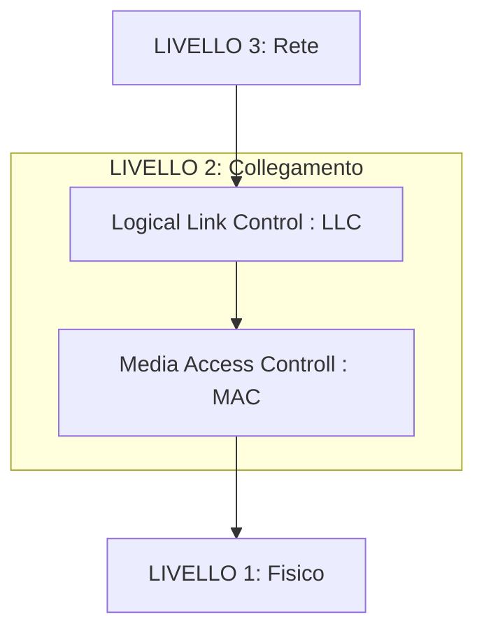
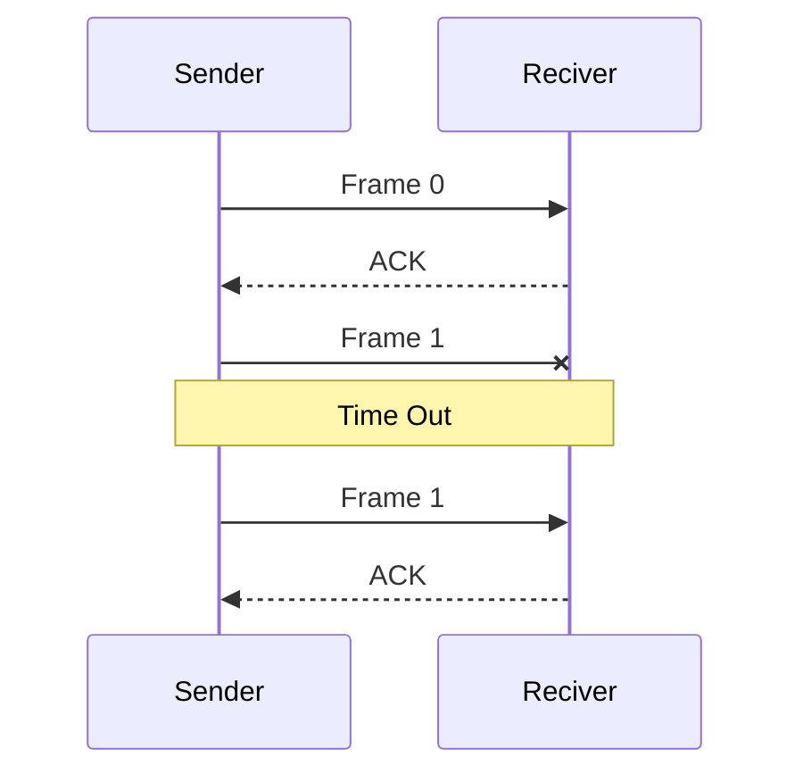
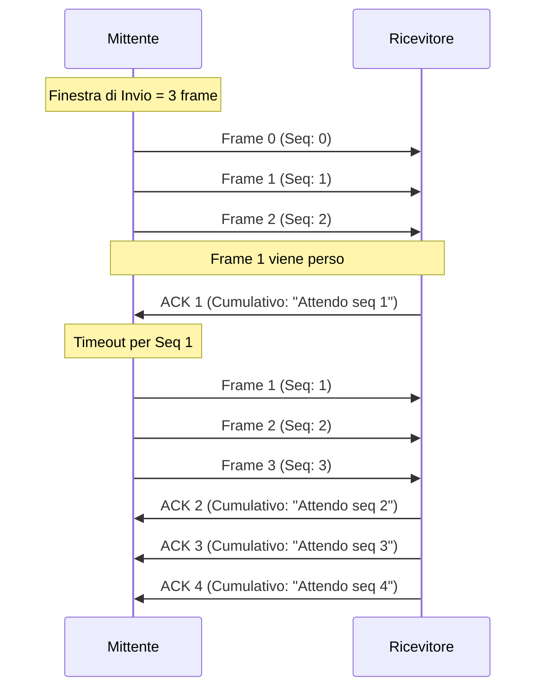
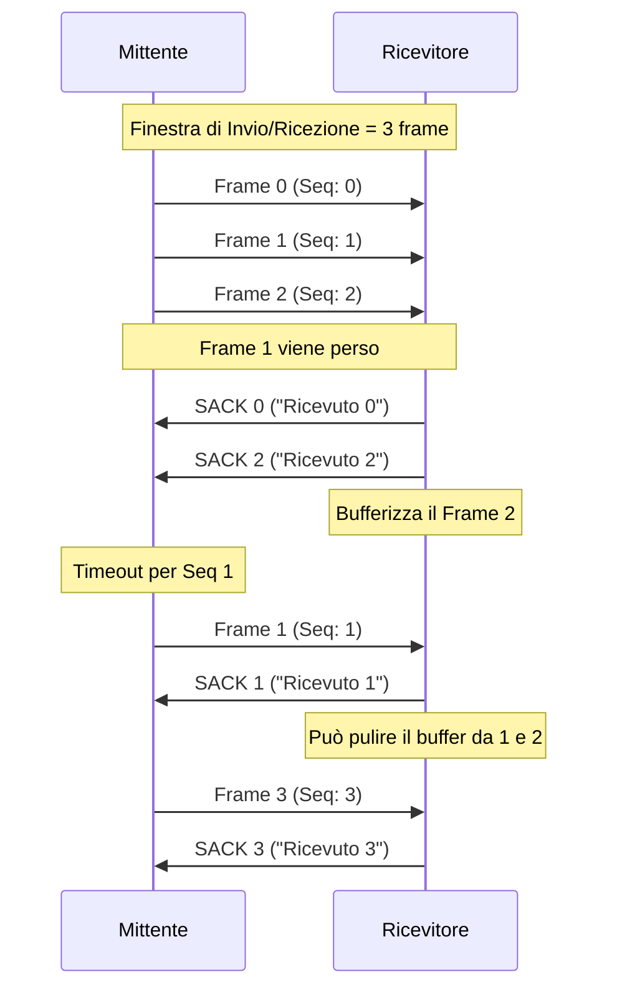
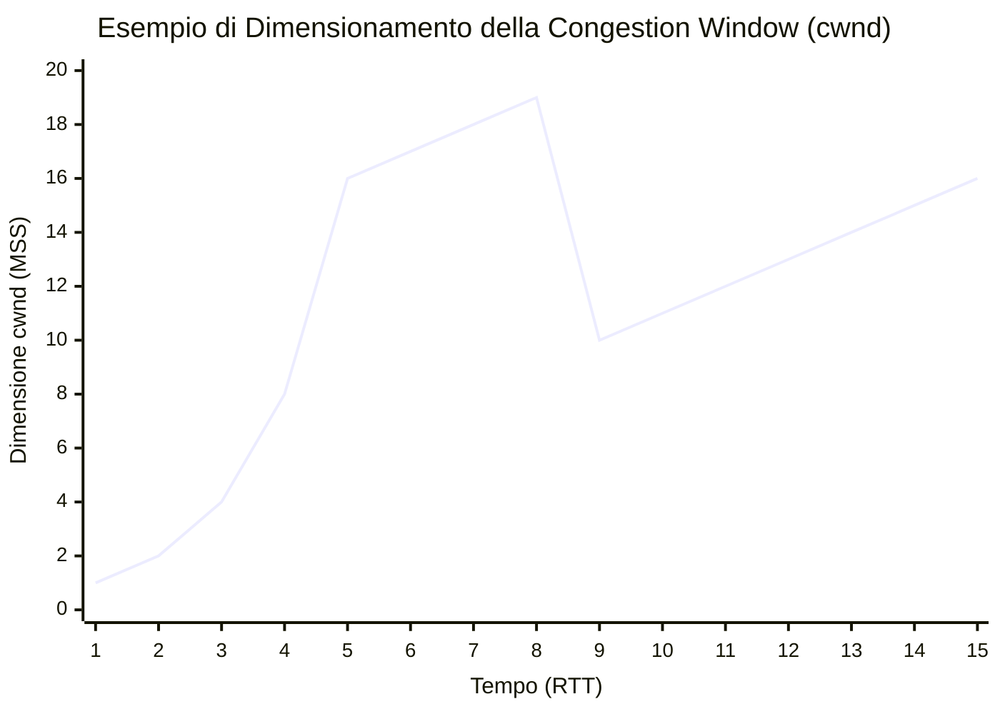

*Il seguente documento presenta gli appunti scritti in preparazione all'esame di reti di calcolatori. In questi appunti si fa riferimento alla pila TCP/IP ( e UDP/IP)*

# Protocollo di livello Collegamento (2°)
> Nel livello di Collegamento le "unità" trasmesse sono chiamate **Frame**
> Questo livello si occupa dell'indirizzamento fisico

Nella pila TCP/IP, il livello di collegamento è concettualmente *diviso in due **sotto-livelli***:
- *Media Access Control* **(MAC)** : Gestione dell'accesso al mezzo fisico
- *Logical Link Control* **(LLC)** : Controllo del flusso e dell'errore
Semplificando  i ruoli dei due *sotto-livelli* possiamo definire che il **MAC** si preoccupa del "chi può parlare e quando" sul cavo, mentre il **LLC** si preoccupa di "assicurarsi che il messaggio sia arrivato correttamente e in ordine" tra due endpoint logici.
## Media Access Control (MAC)
Il sottolivello **MAC (Media Access Control)** è il gestore dell'accesso al mezzo fisico. La sua funzione primaria è regolare _come_ e _quando_ un dispositivo può trasmettere su un mezzo condiviso. 
Inoltre, il MAC definisce l'indirizzamento fisico univoco tramite gli **indirizzi MAC** (Media Access Control address) e si occupa dell'incapsulamento dei dati in frame, aggiungendo un header con gli indirizzi di sorgente e destinazione e un trailer con un checksum (FCS) per la rilevazione degli errori di trasmissione.

## Logical Link Control (LLC)
Il sottolivello **LLC (Logical Link Control)**, invece, opera a un livello di astrazione superiore, fornendo servizi di controllo indipendentemente dalla specifica tecnologia di rete fisica sottostante. La sua funzione cruciale è il **_multiplexing_** dei protocolli di livello superiore: tramite i campi **LSAP (Link Service Access Point)** nel suo header, identifica se il payload del frame deve essere consegnato a IP, ARP o un altro protocollo, permettendo a tutti di convivere sulla stessa scheda di rete. Fornisce inoltre servizi opzionali di controllo del flusso e recupero dagli errori (ad esempio, tramite ritrasmissione nelle sue modalità orientate alla connessione), sebbene nella pratica moderna questi ultimi siano spesso delegati a protocolli di livello superiore come TCP.

## Header Frame
Un frame non è un unico blocco monolitico. È composto da diverse sezioni, ognuna aggiunta da un componente diverso dello stack di rete.
Generalmente è composto da: 
**< Header MAC >  < Header LLC  >  < Dati (Payload) >  < Trailer MAC >**

**DESCRIZIONE:**
I dati arrivanti dal livello 3 vengono incapsulati dal Header di LLC.
Successivamente viene Incapsulato da un ulteriore Header di MAC a cui si accoda un TRAILER MAC contenente il checksum per il rilevamento degli errori.

## Controllo di Flusso
Sono protocolli di gestione del flusso su un canale (Domanda di calcolo dimensione del frame)

### Idle-RQ (Stop and wait)
Idle RQ prevede l'invio di un frame e l'attesa di ACK prima di proseguire con la spedizione dei rimanenti.
L'invio avviene serialmente con la sequenza **Invio** > **Attesa** > **ACK**
Ogni attese prevede un timer entro il quale **l'ACK deve essere ricevuto** altrimenti si considera perso il frame spedito e scatta quindi la **ritrasmissione**.

#### Utilizzo del Canale
$$
Usage = 
\frac{Tempo_{tx}}
{(Tempo_{tx} + 2Tempo_{propagazione})}
$$
**Formulario**
$$
Tempo_{tx} = \text{Tempo di trasmissione del Frame} = Bit / Mbps (Secondi)
$$
$$
Tempo_{propagazione} = \text{Tempo di propagazione del segnale sul canale} = Distanza / Velocita_{canale} (Secondi \ o \ multipli)
$$

### Continuous RQ - Go back N
Più efficente di Idle RQ, permette di trasmettere una n-finetra di frame prima di aspettare il segnale di ACK, ottimizzando quindi l'invio.
Go back N prevede che in caso di mancato ACK o (NACK) il mittiente rinizi a spedire tutti i frame ripartendo da quello perso.
Questo aumenta l'utilizzo del canale anche se la ritrasmissione implica il rinvio di frame potenzialmente già ricevuti.

#### Utilizzo del Canale
Grazie all'utilizzo della n-finestra l'utilizzo del canale aumenta con un upperBound di $$N * Usage_{Idle-rq}$$
tuttavia il penalty di ritrasmissione (dover ritrasmettere tutti i frame dal perso) lo rende in efficiente su canali rumorosi poiché implica la ritrasmissione di frame già inviati e potenzialmente corretti.

### Continuous RQ con Selective Repeat
si basa sullo stesso principio di finestre di Go-Back-N, tuttavia invece di ritrasmettere tutti i frame dal mancante, vengono ritrasmessi **SOLO i frame che vengono persi**.
Questo è possibili tramite ACK selettivi (denominati *SACK*) che permettono di notificare la recezione dei frame anche non in ordine.
Con questo protocollo aumenta la complessità di gestione ma aumenta l'efficienza poiché non vengono ritrasmessi frame inutili.

#### Utilizzo del Canale
Analogamente a Go-Back-N, l'uso del canale tende a $N * Usage_{idle-rq}$ , tuttavia anche in canali rumorosi rimane efficiente.
# Protocollo di livello Rete (3°)
> Nel livello di Rete le "unità" trasmesse sono chiamate **Pacchetti** o **Datagramma IP**
> Questo livello si occupa della determinazione dei percorsi e dell'indirizzamento logico

## IPv4
IPv4 è un protocollo di **livello di rete** (Layer 3) della pila TCP/IP. È un protocollo **non orientato alla connessione** (connectionless) e **non affidabile** (unreliable).
La sua funzione principale è l'**instradamento** (routing) e l'**indirizzamento logico** dei pacchetti attraverso le reti. Utilizza un sistema di indirizzi a **32 bit**, rappresentati in notazione decimale puntata (es. `192.168.1.1`), che fornisce uno spazio di indirizzamento di circa 4,3 miliardi di indirizzi.
### Header IPv4
![[IPv4_Packet-en.svg]]
- Version: il campo versione sono 4 bit che specificano la versione del protocollo (4 per ipv4)
- IHL (Header Lenght): 4 bit che indicano la dimensione del header in parole da 32 bit (minimo 5)
- Type of Service: 8 bit che indicano priorità e tipo di servizio
- Total Length: 16 bit che definiscono la lunghezza totale del datagramma
> Massima dimensione di un datagramma IP è 65.535 Byte
- Identification: Valore univoco assegnato per riassemblare i datagrammi frammentati
- Flags: 3 bit per contrallare la frammentazione
	- Bit 0: riservato *(andremo mai a capire cosa cazzo vuoldire riservato?)*
	- Bit 1 *Do not Fragment*: se impostato proibisce la frammentazione del pacchetto
	- Bit 2 *More Fragment*: se impostato indica che questo non è l'ultimo pacchetto
- Fragment Offset: Specifica la posizione del frammento nel datagramma originale.
- Time to Live (TTL): è un contatore che viene decrementato da ogni router che elabora il pacchetto, se arriva a zero il pacchetto viene eliminato.
- Protocol: identifica il protocollo al livello superiore utilizzato nel payload
- Header Checksum: un controllo di integrità calcolato solo sull'header. viene ricalcolato da ogni router per colpa del TTL.
- Source Address: Indirizzo di origine del datagramma
- Destination Address: Indirizzo del destinatario del datagramma
- Options: Campi opzionali per varie funzionalità speciali.
> Esiste un padding di soli 0 per garantire che l'header sia esclusivamente dimensionato come multiplo di 32 bit

### NAT
Il **NAT (Network Address Translation)** è un meccanismo fondamentale, implementato a livello di router, concepito per ovviare alla carenza di indirizzi IPv4. Il suo funzionamento si basa sulla traduzione degli indirizzi IP privati utilizzati dai dispositivi all'interno di una rete locale (LAN) in un unico **indirizzo IP pubblico**, condiviso da tutti i dispositivi per accedere a Internet, e viceversa per il traffico di ritorno.
#### Funzionamento
Il **NAT (Network Address Translation)** opera principalmente nella sua modalità **PAT (Port Address Translation)**. Quando un datagramma viene instradato dall'interno verso l'esterno di una rete locale, il gateway NAT sostituisce l'indirizzo IP privato del mittente con il proprio indirizzo IP pubblico. Contestualmente, risalendo all'header di livello di trasporto (TCP/UDP), sostituisce anche la porta sorgente originale con una porta unica da esso gestita. Questa doppia traduzione (IP e porta) gli permette di distinguere le sessioni di comunicazione di tutti i dispositivi interni condividendo un unico indirizzo IP pubblico verso l'esterno.
#### Tabella NAT
| Protocolo | Internal IPv4 | Internal Port | External IPv4 | External Port |
| --------- | ------------- | ------------- | ------------- | ------------- |
| TCP       | 192.168.0.69  | 42069         | 10.30.7.162   | 10001         |
- **Protocol**: Protocollo di livello trasporto usato dalla connessione
- **Internal IPv4**: Indirizzo privato del dispostivo interno alla rete (LAN)
- **Internal Port**: Porta di Origine utilizzata dal dispositivo interno alla rete (LAN)
- **External IPv4**: Indirizzo pubblico del router/gateway
- **External Port**: Porta di Origine univoca assegnata a questa connessione dal router/gateway
*Sono presenti anche altri campi per la gestione dell'allocazione e deallocazione delle porte (campi di TimeOut e Status)*

## IPv6
IPv6 è il successore di IPv4, progettato per risolverne le principali limitazioni, prima tra tutte l'esaurimento degli indirizzi. Opera anch'esso al **livello di rete** (Layer 3) della pila TCP/IP. Come IPv4, è un protocollo **non orientato alla connessione** e **non affidabile**.
### HEADER IPv6
![[IPv6_header_rv1.png]]
#### Descrizione dei campi
- **Version (4 bit)** : Versione del protocollo (per IPv6 corrisponde la 6)
- **Traffic class** : Analogo al ToS di IPv4, viene utilizzato per classificare il traffico e gestire il QoS.
- **Flow Label (20 bit)** : Campo utilizzato per identificare uno "stream" di pacchetti
> *"Stream di pacchetti"* : Sequenza di pacchetti inviati da una sorgente a una destinazione che richiedono lo stesso trattamento da parte dei router.
- **Payload Length** : Dimensione del payload in Byte, non include la dimensione di *"Header"* (IPv4 si invece)
- **Next Header** : Sostituisce il campo protocolo di IPv4. il suo funzionamento è di identificare il protocollo a livello superiore o la presenza di un **Header di estensione**
- **Hop Limit** : Funzione analoga al TTL di IPv4. decrementato da ogni router fino al raggiungimento dello 0, dopo di che viene scartato il pacchetto.
- **Source Address(128 Bit)** : Indirizzo Mittente
- **Destination Address(128 bit)** : Indirizzo del destinatario
### Header Estensione
Una delle innovazioni più potenti di IPv6 è il sistema modulare degli **header di estensione**. Invece di avere un header singolo e monolitico con opzioni (come in IPv4), IPv6 utilizza una catena di header specializzati che vengono inseriti tra l'header di base e il payload.
Il **Next Header** funziona come un descrittore del prossimo header in catena. L'ultimo nodo è sempre un descrittore del protocollo di livello trasporto.

## Routing
Il suo scopo principale è l'**instradamento (routing)** dei pacchetti attraverso reti multiple, dalla sorgente alla destinazione, utilizzando un sistema di **indirizzamento logico** (*Protocolli IPvx*).
I protocolli di Routing si differenziano in due grandi categorie:
- Protocolli a Distance Vector (*come RIP*)
- Protocolli a Link State (*come OSPF*)
### Distance-Vector
L'idea principale dei protocolli Distance-Vector è quello di farsi informare dai router adiacenti quali reti conoscono (e a che distanza) e in base a quello determinare quali reti sono raggiungibili.
La loro semplicità li rende adatti per **piccole reti omogenee e stabili**.
Il funzionamento è relativamente semplice:
- I router comunicano periodicamente con i router collegati direttamente la propria routing table.
- Alla ricezione di una nuova tabella i router aggiornano la propria con la logica di modificare solo se è presente un collegamento migliore.
I Distance vector presentano il rischio di **loop di routing**.
> es. R1 pensa che la via per una rete sia R2, e R2 pensa che la via sia R1

per evitare il problema esistono diverse tecniche:
- **Split Horizon**: Dalla tabella di routing vengono rimosse le rotte che passerebbero dal collegamento su cui viene mandata.
- **Poison Reverse**: Quando viene registrata una rotta viene annunciata sul collegamento come "_infinita_", in questo modo l'arco di collegamento diventa unidirezionale.
- **Holddown Timers**: Quando una rotta viene annunciata come irraggiungibile viene avviato un timer nel quale ogni tipo di aggiornamento della rotta per quella rete viene ignorato; unica eccezione se la rotta originale torna ad essere valida.
#### RIP: Routing Internet Protocol
Il RIP è uno dei più antichi protocolli di routing dinamico, classificato come **Distance-Vector**.
Il protocollo usa come metrica gli _Hop_ ovvero il numero di router attraversati, con un massimo di 15 router.
Il valore **16** assume il valore di "_Irraggiungibile_" o "_Infinito_".
Rip è un protocollo estremamente limitato il cui uso è limitato a reti di piccole dimensioni, inoltre gli aggiornamenti periodici e i timer di holddown rendono molto lenta la risposta ai cambiamenti nella rete e la trasmissione periodica dell'intera tabella rallenta canale generando traffico spesso inutile.
### Link-State
I protocolli **Link-State** rappresentano l'evoluzione moderna e più sofisticata rispetto ai protocolli Distance-Vector. Ogni router costruisce una **mappa topologica completa e identica** della rete e applica un **algoritmo matematico** (Dijkstra) per calcolare il percorso più breve verso tutte le destinazioni.
Il meccanismo fondamentale dei Link-State è il **Flooding** che consiste nel generare un un pacchetto speciale chiamato **LSA** contenente i suoi *collegamenti diretti*. 
Ogni router nella rete inoltra i pacchetti _LSA_ che riceve a tutte le interfacce a cui è collegato (tranne quella di origine), così facendo l'informazione viene propagata e condivisa con tutta la rete.
> Viene creata una vera e propria rappresentazione del grafo di rete come Database di Archi.
> Il DB creato è identico in tutti i router in quanto la propagazione avviene uniformente.

La rotta nel grafo viene tracciata attraverso **l'algoritmo di Dijkstra**
#### OSPF
**SPF (Open Shortest Path First)** è il protocollo di routing **Link-State** più diffuso e importante per le reti.
È uno standard **aperto** (definito nell'RFC 2328) che supera tutte le limitazioni dei protocolli Distance-Vector.
Il protocollo prevede la creazione di una mappa topologica della rete tramite 3 Database:
- Tabella dei Vicini: Contiene tutti i router OSPF connessi direttamente
- Link-State DB: Rappresenta la mappa completa della rete
- Tabella di routing: memorizza i risultati dell'algoritmo di Dijkstra (_memorizzato per evitare il ricalcolo e velocizzare il routing_)
- 
La caratteristica più potente di OSPF è la sua **capacità di suddividere** una grande rete in **aree** per ridurre il overhead computazionale e di traffico. Questa qualità è particolamente utile per evitare un flooding eccessivo nella rete.
- **Area 0 (Backbone Area):** **Obbligatoria.** Tutte le altre aree devono connettersi direttamente all'Area 0. Il suo compito è instradare il traffico _tra_ le diverse aree.
- **Aree Non-Backbone (Area 1, Area 2, ...):** Aree periferiche. Contengono router i cui database devono solo conoscere la topologia della loro area, non di tutta la rete.
- **ABR (Area Border Router):** Un router che ha interfacce in almeno due aree diverse (es. Area 0 e Area 1). Si occupa di iniettare rotte riassuntive tra un'area e l'altra.
- **ASBR (Autonomous System Boundary Router):** Un router che ridistribuisce rotte provenienti da un protocollo di routing esterno (es. EIGRP, BGP) all'interno di OSPF.
# Protocollo di livello Trasporto (4°)
> Nel livello di trasporto le "unità" trasmesse sono chiamate **Segmenti**
> Questo livello si occupa delle connessioni End-to-End e dell'affidabilità.
> La gestione di questo livello (e successivi) è a livello degli host.

Un Segmento è formato da:
- Header: contenente porte, numero di sequenza (ISN), flags, checksum
- Payload: Dati provenienti dal livello applicazione da trasmettere.

## TCP
Il protocollo TCP IP è un protocollo di rete a pacchetto posizionato nel layer di trasporto della pila ISO-OSI o Ethernet.
TCP è un protocollo affidabile ovvero garantisce la ricezione di tutti i pacchetti inviati dal mittente.
### Header TCP
![[tcp_header.svg]]
- Source Port: numero di porta di rete che ha generato il segmento
- Destination Port: numero di porta di rete a cui è destinato il segmento
- Sequence Number: Numero di byte inviati nella sessione
- ACK Number: Numero di byte ricevuti nella sessione
- Header Lenght: indica dove inizia il payload. specifica la lunghezza dell'header in parole da 32 bit
- Reserved Bit: 6 bit riservati ad usi futuri (wtf ???)
- Flag di controllo: sono 6 bit che rappresentano funzionalità di controllo del protocollo:
	- URG: i dati del segmento flaggato urgent necessitano di essere elaborati prima
	- ACK: indica che si tratta di un segmento ACK (valida il ACK number)
	- PSH: indica al ricevitore che deve inviare(spingere) i dati all'applicazione senza buffering
	- RST: Termina la connessione forzatamente, viene anche usato per rifiutare una connessione o un segmento non valido (che non appartiene a nessuna connessione)
	- SYN: Indica l'inizio o la richiesta di una connessione. In questo segmento è presente anche il ISN
	- FIN: Indica la chiusura di una connessione. (Chiusura del canale mittente)
- Window Size: indica la quantità di byte disponibili nel buffer del ricevente. rappresenta quanti byte sono ricevibili a partire dal ACK number.
- Checksum
### Enstablish a connection
Il protocollo TCP stabilisce una connessione affidabile tramite una procedura di connessione chiamata **"3-Way Handshake"**.
Questa procedura prevede un dialogo tra client e server tramite l'invio di segmenti TCP:
- SYN (Syncronize): il primo segmento viene inviato dal client. nel segmento il flag SYN viene impostato ad "1", inoltre viene incluso un numero di sequenze iniziale (ISN)
- SYN-ACK: Il secondo segmento viene inviato dal server dopo aver ricevuto il "Syn". Questo segmento avrà i flag SYN e ACK impostati ad "1", inoltre conterrà anche il numero di sequenza iniziale del server e ISN incrementato.
- ACK: il terzo e ultimo segmento viene inviato dal client alla ricezione del SYN-ACK. Questo segmento conterrà solamente il flag ACK impostato a "1", inoltre invier ISN del server incrementato
### Closing a connection
TCP supporta due modi differenti di chiudere una connessione:
- Graceful connection release: la connessione rimane aperta finche entrambi gli host non chiudono il loro canale di comunicazione. (chiusura Assimetrica)
- Abrupt connection release: uno dei due host è forzato a chiudere la connesione.

Nel dettaglio L'abrout connection release prevede l'invio di un segmento contenente il **Flag RST**.
Il Segmento RST contiene il sequence number 00 se il segmento è inviato come risposta ad una connessione non esistente.

Il modo più comune di terminare una connessione TCP è attraversio il graceful connection  release. Esso consiste nell'utlizzo del flag FIN dell'header.
Come gia anticipato entrambi gli host devono chiudere il loro "Streming" perchè la connessione termini, il procedimento è il seguente:
> Introduco due entità denominate $\alpha$ e $\beta$.
- FIN: $\alpha$ termina di inviare i suoi segmenti e vuole chiudere la connessione. per farlo invia un segmento FIN a $\beta$.  successivamente all'invio del segmento $\alpha$ entra in stato di **FIN_WAIT_1** nel quale aspetterà la risposta di $\beta$ (segment ACK)
- ACK: nel momento in cui $\beta$ riceve il segmento FIN invia subito un segmento di ACK ad $\alpha$
- WAIT_2: dopo aver ricevuto il segmento ACK, $\alpha$ cambierà il suo stato in **FIN_WAIT_2**. Questo prevede che $\alpha$ rimanga in ascolto di ulteriori segmenti e aspetti un segmento FIN di $\beta$ per terminare definitivamente la connessione.
> In questo momento la connesione è chiusa assimmetricamente: $\alpha$ ha chiuso il suo canale verso $\beta$, ma $\beta$ ha ancora il suo canale verso $\alpha$ nel quale pò far transitare segmenti.
- FIN: $\beta$ termina di trasmettere e invia quindi il suo FIN segment a $\alpha$
- TIME_WAIT: ricevendo il FIN segment, $\alpha$ invia un segmento ACK ed entra nello stato di **Time_Wait**. In questo stato $\alpha$  rimane in ascolto nel caso il suo segmento ACK vada perso. il tempo atteso è determinato dal implementazione. Dopo questo periodo la connessione è considerata chiusa e le risorse vengono rilasciate.

### Affidabilità
TCP garantisce che i dati trasmessi arrivino a destinazioe in ordine e una sola volta (Sequence number), per farlo vengono utilizzati dei meccanismi di ACK e Time-Out.
Nel protocollo TCP un ACK (abbreviazione di **"acknowledgment"**) è un messaggio inviato dal ricevente che indica la ricezione corretta di un segmento di TCP.
#### Garantire Ordine
Allo scopo di garantire l'ordine, la non ripetizione e la recezione di tutti i segmenti TCP sono presenti due indici numerici chiamati **Sequence Number (SEQ) e Ack Number (ACK)**.
Il SEQ è un valore *U_INT32* che rappresenta la quantità di byte già trasmessi in questa connesione.
Il ACK è un valore *U_INT32* che rappresenta la quantità di byte ricevuti, in particolare rappresenta il prossimo byte che si aspetta di ricevere.
Esempio con $\alpha$ e $\beta$:
- $\alpha$ invia un segmento con SEQ = 1 e un payload di 69 byte
- $\beta$ riceve il segmento e notifica $\alpha$ con un semento il cui ACK number è 70 (SEQ + LEN)
I vari segmenti vengono memorizzati in un buffer interno che agisce come una coda ordinata in base al SEQ.
I segmenti contigui vengono estratti dalla coda e consegnati al livello superiore (applicazione) mentre se vi è un discontiguità, verrà atteso il segmento.
#### Ritrasmissione
TCP prevede la ritrasmissione qual'ora non venga confermata la recezione di un segmento entro un Timeout (timer).
Sono previsti 2 Meccanismi di Ritrasmissione:
- RTO (retransmission TimeOut): viene avviato un timer per ogni segmento inviato. se non viene ricevuto l'ACK prima dello scadere del timer, ritrasmette il segmento.
- Fast Retransmit: quando il ricevitore nota un gap nel SEQ invia ACK duplicati per il segmento mancante. quando il mittente riceve 3 ACK ritrasmette senza attendere RTO.
#### ACK Cumulativo
Conferma i byte ricevuti in ordine.
guardando il SEQ è possibile accorgersi di un pacchetto mancante.
Esempio:
Mittente invia: {SEQ=100 (50B)} , {SEQ=150 (50B)}, {SEQ=200 (50B)}  
Ricevitore riceve solo {SEQ=100} e {SEQ=200} →  
SEQ il ricevitore ha ACK = 150 con il pacchetto {SEQ=100 (50B)} aspettandosi di ricevere il prossimo SEQ come 150, tuttavia riceve {SEQ=200 (50B)}.
è quindi presente un gap di 50 Byte. di conseguenza reinvia ACK 150
#### ACK Selettivo (SACK)
Come per ACK cumulativo invia ACK con l'ultimo SEQ + LEN. Tuttavia nel caso ci sia un gap vengono inviati gli ACK dei segmenti successivi nel campo SACK.
Questo permette al mittente di reinviare solamente i segmenti mancanti.
### Sliding Window Protocol
In TCP lo sliding window protocol è uno strumento utilizzato per gestire il flusso e l'affidabilità della connesione tra due Host. In Particolare si vuole evitare che un mittente veloce sovraccarichi un ricevitore lento.
Il protocollo prevede che il ricevitore annunci la sua **"Finestra di ricezione"** tramite il campo **Window Size** presente nell'header TCP. Questo valore rappresenta la quantità di Byte disponibili nel buffer, di conseguenza il mittente potrà inviare una quantità di Byte non superiore alla dimensione della finestra.
#### Dimensionamento della Finestra di Congestione 
Il suo dimensionamento non è fisso, ma **dinamico** e si basa su un algoritmo che reagisce allo stato percepito della rete. L'obiettivo è trovare il rate di trasmissione massimo possibile senza sovraccaricare la rete.
- **Slow Start:** Inizialmente la finestra è impostata ad un valore molto piccolo (solitamente a 1 Maximum Segment Size). Ad ogni **ACK ricevuto** la dimensione viene raddoppiata.  La finestra cresce esponenzialmente fino a **una soglia** chiamata ssthresh (slow start threshold) o finché non avviene una **perdita di pacchetti**. Una volta raggiunta la soglia inizia la seconda fase. 
- **Congestion Avoidance**: in questa fase la finestra crescerà in modo lineare aumentando di 1 MSS per ogni ACK.
In caso di perdita di pacchetti la connessione considera la rete come congestionata e reagirà in modo differente in base all'evento:
1) **Time Out** (*perdita grave*):
   la ssthresh viene impostata come la metà della finestra corrente. si resetta la finestra e si riparte con la fase di *slow start*
2) **3 ACK duplicati** (*Fast Recovery*):
   La ssthresh viene impostata come la metà della finestra corrente e la finestra viene dimezzata. dopo di che riparte la fase di **congestion avoidance** considerando subito i 3 ACK che hanno causato il fast recovery.

# Protocollo di livello Applicazione
>In questo livello le **"unità"** trasmessa viene chiamate **"dati"**, **"payload"** o **"messaggi"**.
>I dati non hanno un formato definito, possono essere testuali cosi come binari.
## HTTP
HyperText Transfert Protocol (HTTP) è un protocollo di livello applicazione basato su TCP utilizzato per la trasmissione di dati.
Il protocollo è strutturato su una architettura client/server.
Sono previsti due tipi di messaggi in HTTP:
- HTTP request
- HTTP response
Questo protocollo prevede la chiusura della connessione dopo aver effettuato soddisfatto una richiesta o una catena di richieste.
### HTTP 1.0
La versione 1.0 del protocollo risale all'anno 1996.
Questa versione del protocollo oltre a trasmettere il Testo invia anche:
- Header: possibilità di trasmettere metadata
- Versione Protocollo
- Status Code: nelle risposte determina l'esito delle richieste
- Content-Type: è possibile fornire il tipo di testo trasferito
- Method: è possibile eseguire le request con due metodi (Get e Post)

### HTTP 1.1
La versione 1.1 del protocollo aggiunge alcune estensioni alle funzionalità:
- Keep Alive Connection: viene introdotta la possibilità di eseguire più richieste senza dover chiudere e riaprire la connessione TCP per ogni chiamata.
- Continue Status: viene aggiunta una feature che permette di inviare il solo header di una chiamata per informarsi se il server può processarla
- Nuovi Metodi: vengono aggiunti nuovi metodi per le richieste (PUT - PATCH - DELETE - CONNECT - TRACE - OPTIONS)

### HTTP 2.0
La versione 2.0 del protocollo cerca di evolvere le prestazioni del protocollo.
- Async Request: le richieste non sono più gestite serialmente ma vengono processate in modo asincrono tra di loro
- Priorità della Richiesta: è possibile impostare una priorità in una sequenza di richieste

### HTTP 3.0
La versione 3.0 del protocollo cambia completamente approccio:
Non viene più utilizzata una connessione TCP come nel 2.0 ma viene utilizzato UDP  il protocollo QUIC (quick UDP internet connection).
